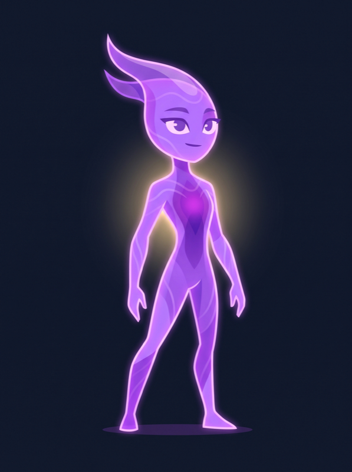
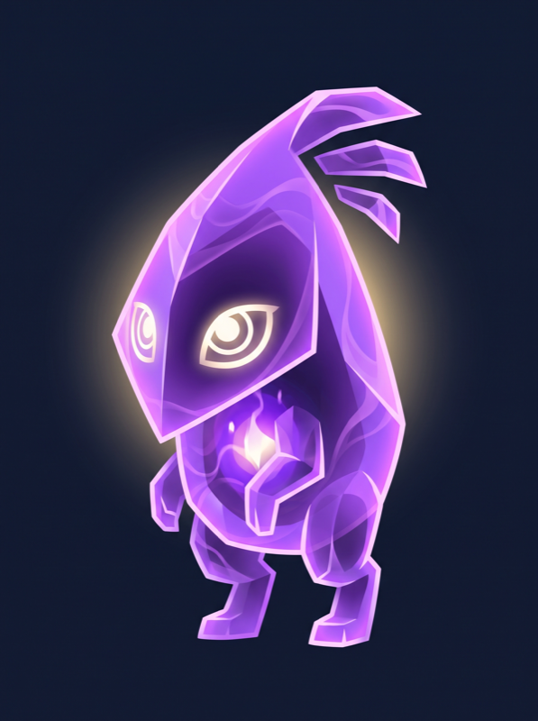
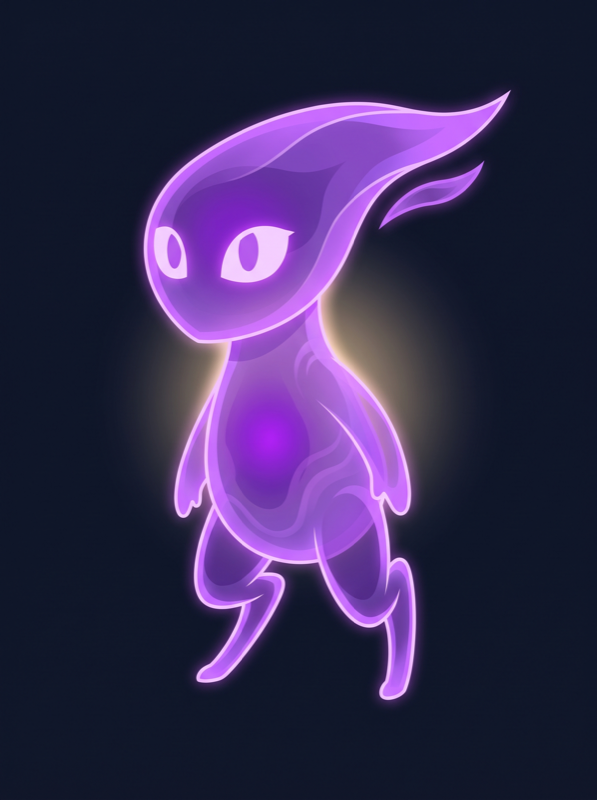
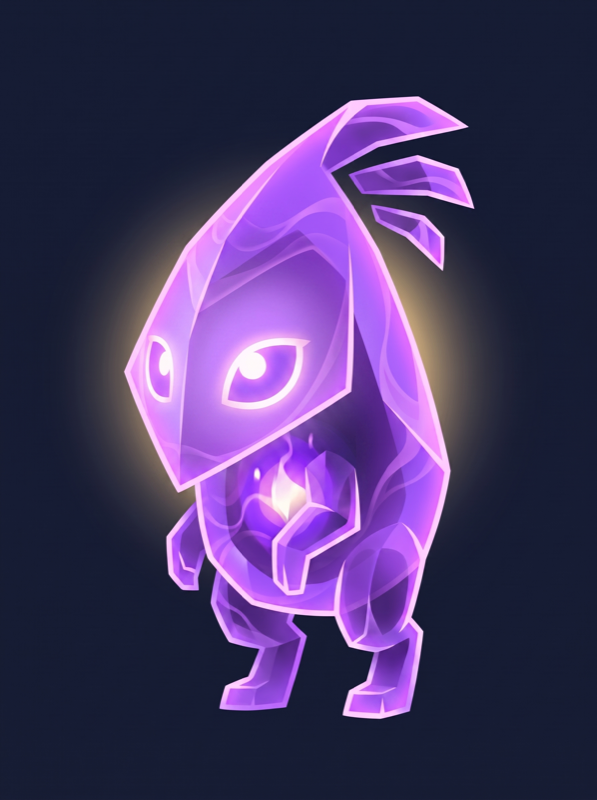

# Avatar Design Brief — Making a Pet Worth Caring About

> **Status:** Living doc, co-authored. Phase 2 item 9 (avatar identity pass).
> **Maturity legend:** ✅ AFFIRMED (Adrian confirmed) · 🟡 DRAFT (my hypothesis, react to it) · 🔴 OPEN (needs Adrian's input)
> **Origin:** Born from the 2026-07-04 design deep-dive. Supersedes the procedural-only framing of Phase 1; operationalizes ADR-0006 (hybrid rendering).
> **Rev 2:** 2026-07-04 — Adrian answered §11 questions; sections 2/3/4/6/7/10 updated; new questions raised (see §11).
> **Rev 3:** 2026-07-05 — Zelda ceremony tiers + WoW rarity channel folded into §6/§8.
> **Rev 4:** 2026-07-06 — §8.1 gender-neutral construction rules pinned to concrete tests (answers §11 Q2); §8.2 Stage-2 Flux reference illustration spec added; first reference generations run against it.

---

## 0. How to use this doc

This is the source of truth for the pet's **art direction and emotional intent**. Visual choices (silhouette, color, face, motion) get evaluated against the principles here — not against "looks cool." If a proposed visual serves Sections 3-5, it's in. If it doesn't, it's out, no matter how polished.

Sections graduate from 🟡/🔴 to ✅ as they stabilize. ✅ sections become hard constraints on Higgsfield prompts and overlay code.

---

## 1. Why this is the make-or-break decision

The 2026-07 audit put it plainly: *"the result reads as clipart, not creature."* Phase 1's procedural renderer works technically but failed the art-direction bar — exactly the risk the docs' own register predicted. **IronQuest's defensibility depends on the pet earning attachment.** A tracker with a clipart pet is just Strong/Hevy with a coat of paint, and lifters won't switch.

The market research is clear on the niche: no shipping app makes a creature whose *body* is a function of your training. The wedge is open. Capturing it requires a pet that's (a) worth caring about and (b) visibly yours. This brief is about (a); item 12 (typed-FP recalibration, PR #43) is about (b).

---

## 2. Target user — ✅ AFFIRMED

**Both** the 4–6 day/week intermediate *and* the newer lifter who needs motivation to build consistency.

This dual persona shapes the emotional register:
- **Newer lifter:** the pet must motivate early consistency. Stage 1 can't read as "you have nothing" — it must read as *"you started, and this is the beginning of something."* The first 2–3 weeks (habit formation window) need celebration density, not austerity.
- **Intermediate:** the pet makes meticulously-tracked data emotionally legible. Their spreadsheet finally *feels* like something. Pride in accumulated work.

The pet serves both by being a **mirror with a growth arc** — early encouragement curving into mature pride. The same creature reads differently as it accumulates.

---

## 3. Emotional goal — ✅ AFFIRMED

**Pride and recognition** — *"I built this. I earned this. This is a reflection of me."* The pet is a mirror reflecting accumulated effort back, made visible.

Refined by the dual persona (§2): for newer lifters, the pride is *forward-looking* ("I'm becoming someone who trains"); for intermediates, it's *backward-looking* ("I've built this over time"). The pet serves both by making the arc visible at every stage.

This is why "fun/cute" is the wrong axis — it's the casual-gamification register (Wokamon, GymPet, Habitica pets) and infantilizes. Pride is heavier and survives the 6-month novelty cliff.

---

## 4. The "not a chore" principle — ✅ AFFIRMED (hardened)

> *"I don't want it to feel like a considerable chore — like I'm managing myself AND my avatar. But I want it to feel rewarding."* — Adrian, 2026-07-04

**Hard constraint**, equal weight to "No Punishment for Absence." Hardened in Rev 2: **hunger/mood/feeding are dropped from v1 entirely.** The pet's state changes **only from workouts** (passive progression via the FP engine). No survival mechanics, no decay, no feeding obligation.

| Chore pattern (reject) | Rewarding pattern (keep) |
|---|---|
| Pet decays / looks pathetic if you don't log in | Pet reflects what you've *done*, never what you *owe* |
| Feeding / hunger / mood maintenance | **Dropped from v1 — pet changes only from workouts** |
| Guilt-tripping copy ("your pet missed you") | Honest mirror with no judgment tone |
| Penalty for absence | Vacation mode unnecessary (no decay to freeze) |

**Implication for the visual:** the pet never looks needy, starving, or pleading. Its resting state is *earned composure*. There's no "hungry" or "sad" visual state to design around — only growth states.

**Scope impact:** ticket #41 (pet-care depth) is gutted by this decision. Mood, food tiers, auto-feed, and vacation mode are all out. Only "tap reaction" survives from #41's original scope — and that may roll into #40 (celebration). See §11.

---

## 5. Psychological levers 🟡

Three mechanisms, in priority order:

1. **The IKEA effect** (primary) — we overvalue what we help build. Every workout *builds* the pet. The pet must feel *constructed by effort*, not gifted. Stat-driven visual changes must survive in overlay form (tier swap, tint, growth, **gear**).

2. **Endowment / ownership** — we overvalue things once they're "ours." The pet must feel *unique to me*. Typed-FP calibration (#39/#43) is the engine: if every pet converges, ownership breaks.

3. **Mirror / identity** — we bond with representations of self. Heavy leg days → visibly leg-developed creature. The mirroring makes data self-relevant in a way no chart achieves.

**Refused:** the Tamagotchi/Neopets guilt-and-decay loop. Incompatible with §4.

---

## 6. Reference triangulation — ✅ AFFIRMED

Adrian's anchors: **Pokémon, World of Warcraft gear acquisition, Undertale.** The through-line is **progression worn visibly on the character** — effort made into a body.

| Reference | What we steal | How it shows up in IronQuest |
|---|---|---|
| **World of Warcraft (gear + rarity)** | Progression is *worn*, and **value is color-coded** (Common white → Uncommon green → Rare blue → Epic purple → Legendary orange). The rarity tier system is the most-copied progression language in games. | **Overlays = gear slots WITH rarity tiers.** Each gear piece has a stat assignment AND a rarity color (via glow/aura, separate from the stat's fill color). A legendary Power spike reads differently from a common one — aspiration built into the visual language. |
| **Pokémon** | Evolution as a beloved, earned milestone. Type system. Gender-neutral creature archetypes (Pikachu, Lucario — none heavily coded). | Macro progression = evolution (Stage 1→4). Type triangle (Ferro/Flux/Terra). **Gender-neutral by default** (see §10) — avoid heavy gender coding. |
| **Undertale** | Deep personality via minimal geometry — face + timing + writing, not detail. | The face is the leverage (audit §5.2). A few shapes, animated well, beat a detailed static illustration. |
| **Zelda (chest reveal)** | The *ceremony* of acquisition. New items aren't dropped in inventory — they're revealed: chest opens, light, music sting, item held aloft, name displayed. Time spent deliberately; acquisition becomes a *memory*. | **Milestone ceremony.** Evolution and major gear acquisitions get a full reveal moment (~3-5s), not a notification toast. Drives ticket #40 (celebration) scope. |

**The synthesis:** the pet is a character whose **macro** progression is Pokémon-style evolution (stage swaps), whose **micro** progression is WoW-gear-style accumulation with **rarity tiers** (visible achievement layers between evolutions), and whose **milestone moments** use Zelda-style ceremony (the acquisition is the memory). All three encode effort; all three are readable; all three give the user something to chase and remember.

---

## 7. Evolution arc — ✅ AFFIRMED

> *"Why not both? It is a reflection of me in a sense, but we want it to be formidable when we scale the battle tower. People should not be able to evolve quickly. It has to be earned considerably."* — Adrian, 2026-07-04

**Both identity AND formidable.** The pet is a self-portrait *and* a battle-ready creature. These aren't in tension — your specific training produces a specific creature that is formidable *in its own way* (a leg-day beast is formidable differently than a bench-press monster).

**Evolution must be earned slowly.** Current thresholds (500/2000/5000 FP) may be too fast — at ~100 FP/workout, Stage 2 hits in ~5 workouts (~1 week). That's not "earned considerably." **🔴 Open: raise thresholds?** (see §11, Q3).

Stages tell a hybrid story (identity + formidability):
- **Stage 1 — Shard:** nascent, promising. Reads to a newer lifter as "this is the beginning of something," not "you have nothing."
- **Stage 2 — Form:** defined. Type + build become legible. "Your training is shaping this."
- **Stage 3 — Prime:** visibly formidable. Stats maxed in places; looks like it could hold its own. Pride of construction.
- **Stage 4 — Apex:** unmistakably *yours* and unmistakably powerful. A creature only your specific training history could produce — and one ready for the Tower.

**Forward constraint:** the avatar art must support the battle-tower use case (Phase 3). Silhouettes need readable strength/power, not just expression. The pet has to look like it could fight.

---

## 8. Visual principles 🟡 (downstream of 3–7)

Each principle traces to a settled section. Rev 2 additions in bold.

- **Silhouette before detail.** Recognition from silhouette; personalization from deformation. One base body per type, deformed by stats + worn gear.
- **Face is the leverage.** ~90% of geometric-character charm is eyes + timing. The face conveys *earned composure* — confident, not pleading. Never "sad puppy eyes."
- **Color = stat language.** `colors.stats.*` carried onto the pet so radar, stat rows, and creature speak one language.
- **Stat changes are legible at the moment of spend.** Survives via overlays (ADR-0006).
- **No pathetic resting state.** Default expression is composed (§4).
- **Overlays = gear slots (NEW, from §6).** Each achievement adds a visible element (aura ring, marking notch, accessory, weapon-equivalent). The pet accumulates "gear" the way a WoW character does — readable as a training résumé.
- **Gender-neutral by default (NEW, from §10).** No heavy gender coding in the base art. Proportions, features, and expressions stay neutral. Personalization (if ever) is a future feature, not v1.
- **Motion is mandatory (NEW, from §10).** No static pets. Breathing, idle micro-motion, tap reactions, achievement bursts — all required. A static sprite is a sticker, not a creature.
- **Training résumé markings.** Subtle accumulation marks for streaks/milestones (audit §5.4) — one per week of ≥3 workouts, glow intensity from current streak.
- **Rarity color system (NEW, from §6).** Gear carries a rarity tier (Common→Legendary) encoded as glow/aura color, **separate from the stat's fill color**. Two channels, both readable: stat fill = *which* stat; rarity glow = *achievement level*. Aspiration built in (users chase the orange).
- **Acquisition ceremony (NEW, from §6).** Milestones get time spent on them — not rushed past. Tiered: **micro** (gold flash on PR), **minor** (gear materializes with sting), **major** (full evolution reveal, Zelda-style — held aloft, named, ~3-5s). The moment of earning is the memory.

### 8.1 Gender-neutral construction rules 🟡 (concrete — answers §11 Q2)

The principle in §10 ("the user cannot be at the whim of the system's design here") pinned to rules an artist or a prompt can be audited against:

| Zone | Rule | Rejects | Allows |
|---|---|---|---|
| **Torso** | One geometric mass; width changes monotonically (taper or column). **No waist pinch** — no concave inflection between chest and hips. | Hourglass, V-taper-with-tiny-waist bodybuilder coding | Teardrop, column, trapezoid, orb |
| **Face — eyes** | Eye shape carries expression via geometry + timing only. **No eyelashes, no lash line thickening.** | Lash detail, winged corners | Any eye geometry; blink/squint via lid angle |
| **Face — mouth** | Optional. If present: simple line/curve. No lip volume or lip color. | Rendered lips | Beak-like, slit, or no mouth |
| **Surface** | No hair that reads as hairstyle. Crests/fins/energy-plumes fine — they read as *creature anatomy*, not grooming. | Manes styled like haircuts, bangs | Flux energy crest, Ferro plating ridges, Terra moss |
| **Stance** | Strength via mass, groundedness, and posture — never via gendered anatomy (chest emphasis, hip tilt). | Contrapposto hip-shot poses | Square stance, forward lean (Speed), wide base (Guard) |
| **Color** | Type palette only (`colors.types.*` + stat accents). No pink/blue gender-code channels. | — | Full type palette at any saturation |

**The audit test (borrowed from §6's Pokémon row):** *the Lucario test* — shown the creature cold, users of any gender should be able to answer "is this male or female?" only with "…it's a creature." If anyone answers confidently, a rule above was violated.

### 8.2 Reference illustration spec — Stage-2 Flux 🟡 (the §8 pin vehicle)

§8 can't graduate to ✅ in the abstract — it graduates when Adrian reacts to an image. One reference illustration, spec'd from the affirmed sections, generated via Higgsfield (exploration spend, not the production 12):

- **Subject:** Stage 2 "Form" (§7) — defined, becoming, *not* maxed. Type + build legible; visibly mid-arc. Reads as "your training is shaping this," not a finished apex creature.
- **Type language (from `pet-types.md`):** Flux — energetic, fluid, electric. Neon glows, wave patterns, pulses. Type color `#A855F7`. Affinity Speed + Spirit → forward-leaning streamlined silhouette, subtle white-gold aura (`#FEF08A`) at low intensity (Stage 2 ≠ high Spirit yet).
- **Silhouette (audit §5.1):** tall teardrop, readable in pure black at 128 px. Deformation headroom in every direction (spikes, plating, elongation) — the base must not pre-commit to a build.
- **Face (§8 "face is the leverage"):** large simple eyes, **earned composure** — confident, settled, faint upward tilt. Not pleading, not cute-coded, not fierce. Passes every 8.1 rule.
- **Gear readiness (§6):** clean anchor zones where the 6 gear slots would attach (crown, chest, flanks, base) — visually *quiet* zones, not decorated ones. The reference shows zero or one Common-tier piece at most.
- **Formidability check (§7):** could plausibly fight. Poise and density, not menace.
- **Format:** full body, centered, on the app's dark field (`#0F172A`), stylized geometric with glow — flat-shaded planes + emissive accents. No photorealism, no painterly texture, no outline-sticker look.
- **Motion implication (§8):** design must *imply* its idle — a body whose breathing/pulse cycle is obvious from the still (wave patterns want to flow, aura wants to shimmer). If a still looks inherently static, it fails.

### 8.3 Reference generation log — 2026-07-06 🔴 (awaiting Adrian's react)

Four iterations against §8.2, Nano Banana Pro, 8 credits total (month spend now 12/400). Images in `reference-art/`.

| Iter | Image | Verdict | What it taught |
|---|---|---|---|
| v1 |  | ❌ Reject | **The §8.1 rules earn their keep on the first roll.** Prompt said "no human anatomy"; model produced a slim humanoid with eyebrow arch — fails the Lucario test instantly. This is §10's "gender-coded by the system" failure happening by *default*. Production prompts must ban the humanoid frame explicitly and loudly. |
| v2 |  | 🟡 Strong direction | Creature achieved: teardrop silhouette, crest fins, chest core, faceted crystalline planes, genuinely gender-neutral. Misses: hunched/timid stance (Flux = Speed), hooded dark face + spiral irises drift toward "specter," not earned composure. |
| v3 |  | ❌ Overcorrection | Fixed motion + posture but went soft/wispy — reads cute-juvenile (§10 reject) and lost the crystalline construction and all formidability. Useful as the *other* boundary: fluidity without density fails §7. |
| v4 |  | ✅ **Candidate** | v2 refined via image reference: luminous violet face (no shadow cavity), plain almond irises, calmer expression, crystalline construction intact. Stance still leans forward more than spec'd — acceptable for Flux, or fixable in a v5 if Adrian wants more upright poise. |

**Recommendation:** v4 is the Stage-2 Flux direction — crystalline energy planes, composed luminous face, visible core. If affirmed, it becomes the style anchor (image reference) for the production 12, and §8/§8.1/§8.2 graduate to ✅.

**Prompt-engineering findings for the production run (bank these):**
1. Negative constraints stated once get ignored; the humanoid ban needs caps + repetition + a positive replacement frame ("Pokémon-style spirit-animal, large head ≈ ⅓ height").
2. Image-reference iteration (v2 → v4) preserves construction far better than re-prompting from text — generate each type's Stage 2 first, then derive Stages 1/3/4 as reference edits. This also solves cross-stage identity continuity for free.
3. "Digitigrade sprinter legs" pulled the model toward cute; density language ("energy density," "faceted planes") pulled toward formidable. The §7 both-identity-and-formidable balance lives in that tension — tune with one knob at a time.

---

## 9. The glance test 🟡

The UX spec's promise: *a training partner can glance at your pet and read "high-volume leg-day consistency freak."*

| Signal | What it conveys |
|---|---|
| Silhouette proportions | Which body region is developed |
| Color distribution | Which stats dominate (warm = power, cool = speed/control) |
| **Gear / markings** | Specific achievements (PR count, streak weeks, milestones) |
| Size / evolution stage | Total accumulated effort |
| Type (Ferro/Flux/Terra) | Training *character* — explosive vs endurance vs control |

The pet must be a readable training résumé at a 2-second glance. Every visual decision auditable against: *"can someone read this off the pet quickly?"*

---

## 10. Anti-patterns — ✅ AFFIRMED

What we explicitly refuse. Rev 2 additions in bold.

- **Generic AI mascot** — the smoke-test result. Warm starburst with dot eyes, indistinguishable from any icon pack.
- **Needy / pleading expression** — Tamagotchi guilt-bait. Violates §4.
- **Gender-coded by the system (NEW)** — a user's workout split must not generate a pet that reads as feminine (or masculine) in a way that alienates them. **The user cannot be at the whim of the system's design here.** Default to gender-neutral; if personalization is wanted later, it's a user *choice*, not a system output.
- **Too juvenile** — risks infantilizing the "serious lifter" pride.
- **Too dark/edgy** — pride isn't grimness.
- **Realism** — stylized/geometric is the lane, not photoreal.
- **Static (NEW, emphasized)** — a pet without animation is a sticker. Motion is mandatory.
- **Identical across users** — breaks mirror/ownership levers.

---

## 11. Open questions (Rev 2)

Graduated to ✅ in Rev 2: persona (§2), hunger/mood dropped (§4), references (§6), evolution arc (§7), anti-patterns (§10).

**New questions raised by those answers:**

1. **Gear slot taxonomy (from §6/§8) — refined by rarity system:** gear is a **stat × rarity matrix**. Slot = which stat (6 candidates: Power spikes, Guard plate, Speed streamlines, Vigor gem, Focus crest, Spirit aura). Rarity = achievement tier (Common→Legendary via WoW color system, encoded as glow). **🔴 Confirm:** the 6 stat slots + adopt the rarity tier colors as a second visual channel?

2. **Gender-neutral design constraints (from §10):** ~~what specific art-direction rules keep the base neutral?~~ **Pinned in Rev 4 — see §8.1** (zone-by-zone rules + the Lucario test). 🟡 until Adrian reacts to the reference illustration generated against them.

3. **Evolution thresholds (from §7):** are 500/2000/5000 FP too fast for "earned considerably"? At ~100 FP/workout, Stage 2 = ~1 week. Should we raise 5–10×? This is a game-economy decision that affects feel. Connects to `src/config/fp-values.ts`.

4. **Ticket #41 disposition (from §4):** mood/food/vacation all dropped. Options: (a) close #41, roll "tap reaction" into #40 (celebration); (b) repurpose #41 to "personalization v0" — a basic character-customization path addressing §10's gender-sensitivity concern (let user pick aesthetic traits within type constraints). (b) is more ambitious but directly addresses a real user concern.

5. **Newer-lifter Stage 1 tone (from §2):** how does the Stage 1 pet read to someone who's never lifted? Needs to feel promising, not pathetic or empty. Affects the Stage 1 illustration prompt specifically.

---

## 12. What this doc governs downstream

Once sections stabilize, they constrain:
- **Higgsfield prompts** for the 12 base illustrations (ADR-0006) — vibe language comes from §3/§6/§8
- **Overlay system** (procedural, on top of base sprites) — gear slots come from §6/§8/§9
- **Pet-care ticket (#41) scope** — §4 gutted it; §11 Q4 decides disposition
- **Celebration layer (#40) animation vocabulary** — face/eye + achievement-burst reactions come from §8
- **FP economy** — §7/§11 Q3 may raise evolution thresholds

No **production** Higgsfield generation (the 12 base sprites) until §8 is ✅. Rev 4 distinction: **reference/exploration generation is the mechanism for graduating §8** — spec'd in §8.2, prompted only from pinned rules, budgeted as exploration spend (~6 cr). Prompts without intent produce clipart (the smoke test proved this); §8.1/§8.2 are the intent.
